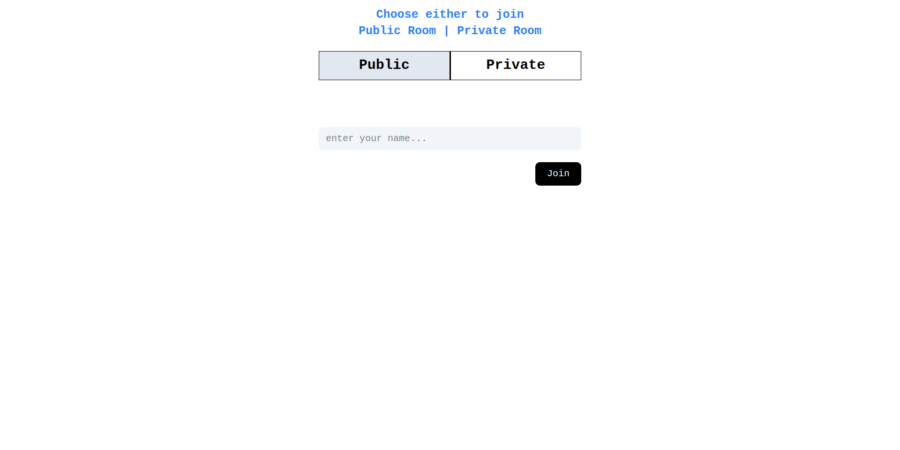
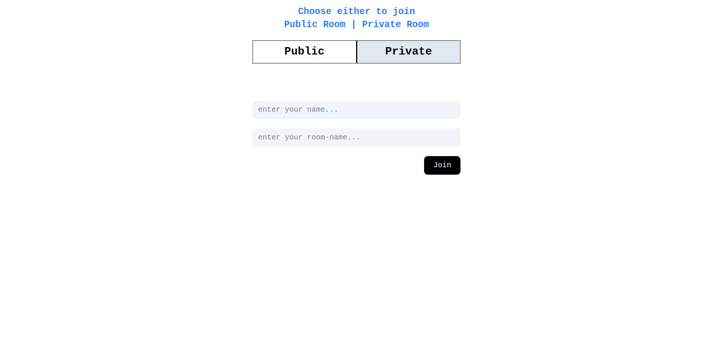
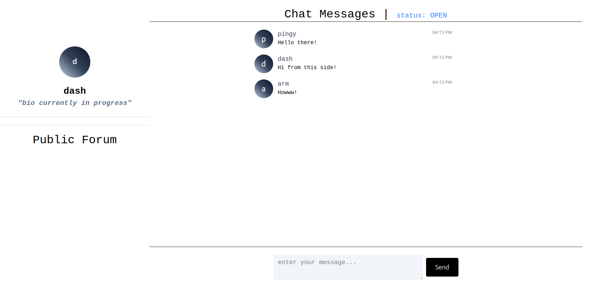
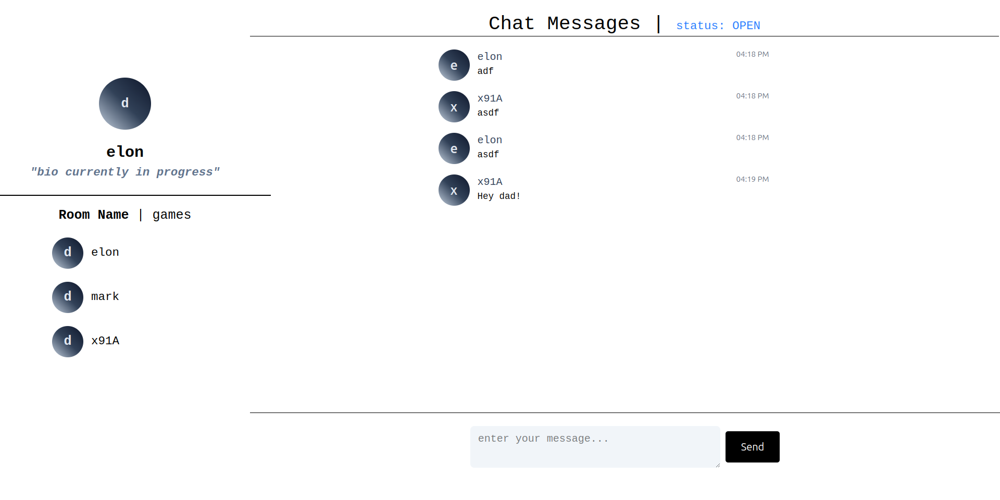

# Junction - A Real-Time Chat Application
Junction is basically like a junction where people gather and communicate within groups. It does support one-to-one communication in backend but its soon to be implemented in frontend. Here people can have two types of Junction one public other private through rooms. 

## Screenshots

    
     
    
     
    
     
    

